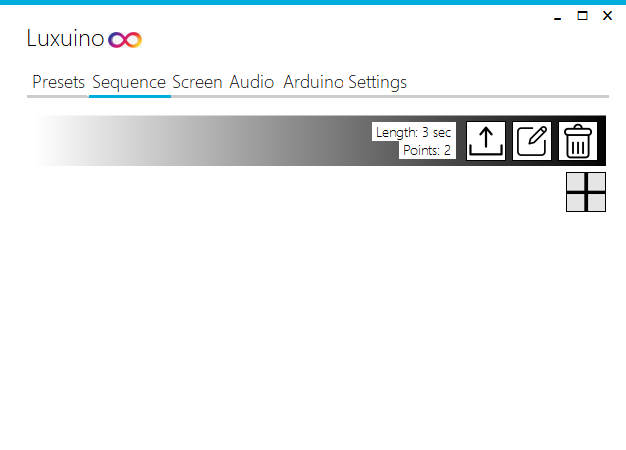
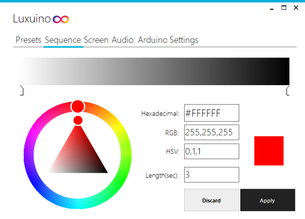
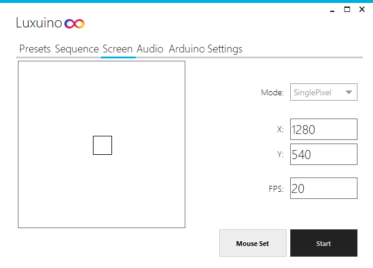
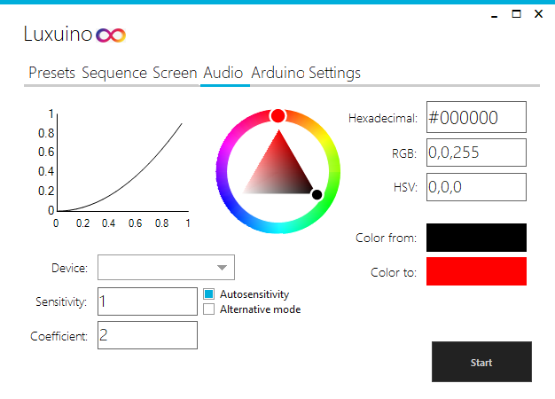
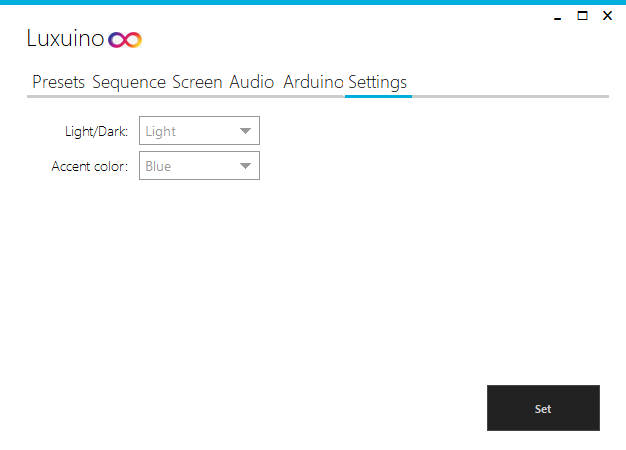
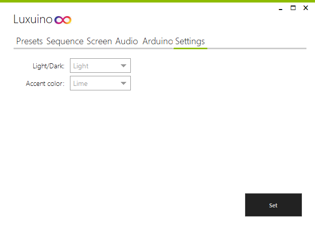
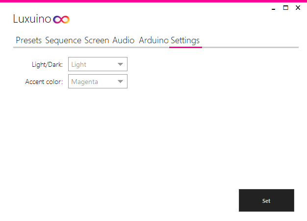

# Luxuino 
A windows application for controlling RGB LED strips with a microcontroller
 
## Getting Started
Luxuino is an application for windows that allows you to use a microcontroller to control RGB LED strips. 
The application makes use of the serial port to communicate with the microcontroller through the usb port. The microcontroller uses pwm to
control the LEDs, which makes this application only usable for non-addressable LED strips. 

### Installing
Unzip the package and open up luxuino.exe. If you need to upload the code to your microcontroller using the application,
make sure the Microcontroller folder is in the same folder as the executable.

## Usage
Luxuino allows you to use multiple different modes to control your LEDs, each with it's own settings and behaviour.

### Presets
These are predefined patterns that are simple to configure and use

#### Static
This is as simple as it sounds. Choose a color and your LEDs will staticly display this color.

#### Breathing
Breathing allows you to choose a color, which the microcontroller will then display in a breathing (on and off fading) pattern.
The `pulse/sec` setting changes how many times per second it should complete the breathing cycle.

### Rainbow
This mode will go through the full Hue spectrum, from 0 to 360 degrees. The `Cycle Length` setting changes how quickly it
does this.

## Sequence
On this page you can create your own color sequences which the controller will loop through.

If you want to add a new sequence, press the `Add` (plus) button and a new black-white sequence should appear.
The `Delete` button deletes your sequence, and the `Upload` (arrow) button sends your sequence to your controller. To edit the sequence, press 
the `Edit` (marker) button and the editor comes up.

Up top you will see the preview of your sequence as a gradient. The first and last marker can be selected to change the color,
but it is also possible to add new markers by clicking the gradient. The markers can be selected and dragged across the gradient
to change the sequence. To change the length of your sequence change the `Length` option.

IMPORTANT: Because of the small amount of memory most microcontrollers possess, it is recommended that you use less than 20 points.
Using more points might result in stability issues.

Sequences are stored in /Appdata/Roaming/Luxuino/Sequences.xml

## Screen
Here you can setup the application to react to the pixels on your screen.

You can select two different modes in the `Mode` setting. `SinglePixel` is simple, it changes the color of the LEDs to the pixel located at the specified `X`
and `Y`. `Average` takes the average color of a set of 100 pixels, located in a rectangle 100 pixels away from all sides of the 
specified `X` and `Y`. This mode works better for movies and games, but puts more strain on the CPU. The `FPS` option changes how often the LEDs are updated per second.
A higher `FPS` will impact the performance of the program. The `Mouse Set` button when pressed will track your mouse position, and when you press `Enter` the `X` and `Y` will
be set to your mouse location.

The application has to remain open for this mode to work.

## Audio
This mode will make your LEDs respond to the output of your soundcard.

The `Color from` setting will be your starting color when there is no audio. The `Color to` is the color the controller fades to.
The chart shows the fade output from 0 `(Color from)` to 1 `(Color to)` on the vertical axis, and the audio level on the horizontal axis. 0 on the horizontal axis
means no audio, and 1 the max audio level without any multiplication by the sensitivity. The `Sensitivity` setting is a multiplier that
multiplies the raw audio level. This way you can get a stronger reaction from low audio or a weaker reaction from loud audio.
The `Coefficient` setting changes the power to which the audio level is raised. This results in a steeper parabolic function
which works well if you want only a strong reaction from loud sounds. 

The `Autosensitivity` can be checked to automatically adjust the
sensitivity to the audio level. The `Alternative mode` setting is a different mode for audio detection. Instead of taking the average of
a set of frequencies this mode looks at the peak output value of a certain audio device. To enable this select an audio device in `Device`
and check `Alternative mode`. Normal mode does not require an audio device to be selected in `Device`.

The application has to remain open for this mode to work.

## Arduino
In this tab you can upload the required code to your microcontroller.

In `Arduino Type` you can change your microcontroller type. The list of included boards are: Leonardo, Mega2580, Micro, NanoR2, NanoR3, UnoR3. 
DISCLAIMER: The only device that is confirmed to work correctly is the NanoR3. I do not have the other boards to test the code on. 
The `Serial port` option specifies what COM port the code should be pushed to. If the program returns `Upload Failed`, make sure you chose the right port
and board type.

By pressing the `Save` button you can save your last send command into the controller's persistent memory. This way when the controller restarts
it will load your last command. The saving feature works for every mode except `Screen` and `Audio`.

## Settings
For now the only options you will find here are appearance related.

`Light/Dark` will change wether the application runs in dark or light mode. `Accent color` changes the accent color for numerous controls.
Settings are saved in /Appdata/Roaming/Luxuino/Settings.xml.

# Used libraries
* [Metro Framework](https://thielj.github.io/MetroFramework/) - For application design
* [NAudio](https://github.com/naudio/NAudio) - For audio capturing
* [Accord Framework](http://accord-framework.net/) - For audio FFT calculations
* [Costura.Fody](https://github.com/Fody/Costura) - For .dll embedding
* [ArduinoUploader](https://www.nuget.org/packages/ArduinoUploader/) - For microcontroller uploading
